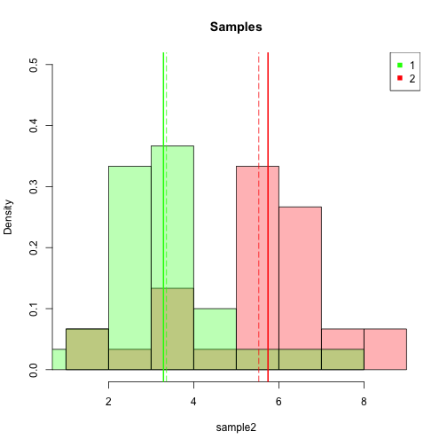
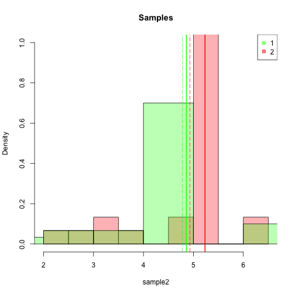

Критерии однородности (параметрические и непараметрические)
==========================================================
Задание 1: Парный T-test
------------------------

Сперва смоделируем связанные выборки...

```r
n <- 50
k <- 1000
mus <- c(2, 3)
sds <- c(1, 2)

cor <- matrix(c(1, 0.6, 0.6, 1), nrow = 2)
print(cor)
```

```
##      [,1] [,2]
## [1,]  1.0  0.6
## [2,]  0.6  1.0
```

```r

generate.paired <- function(n, mus, sds, cor) {
    X0 <- rnorm(n)
    Y0 <- rnorm(n)
    K <- cor * (sds %*% t(sds))
    A <- chol(K)
    
    X <- c()
    Y <- c()
    for (t in 1:n) {
        hh <- t(A) %*% c(X0[t], Y0[t])
        X[t] <- hh[1] + mus[1]
        Y[t] <- hh[2] + mus[2]
    }
    # plot(X, Y, col = 'blue')
    data.frame(X = X, Y = Y)
}
```


Теперь 1000 раз смоделируем выборки и посчитаем парный и независимый тесты Стьюдента:

```r
ps <- sapply(1:k, FUN = function(i) {
    data <- generate.paired(n, mus, sds, cor)
    X <- data$X
    Y <- data$Y
    p.paired <- t.test(X, Y, paired = T, var.equal = F)$p.value
    p.unpaired <- t.test(X, Y, paired = F, var.equal = F)$p.value
    cbind(p.paired, p.unpaired)
})

p.paired <- ps[1, ]
p.unpaired <- ps[2, ]
```


Пример полученных p-value...

```r
head(cbind(p.paired, p.unpaired))
```

```
##       p.paired p.unpaired
## [1,] 5.853e-05  0.0023043
## [2,] 4.709e-05  0.0016511
## [3,] 2.137e-04  0.0020527
## [4,] 2.385e-05  0.0007304
## [5,] 3.137e-04  0.0089778
## [6,] 1.078e-05  0.0004482
```


Итого: 1000 раз p-value парного теста было меньше p-value независимого.

Мощность парного теста: 0.992 (из 1000 раз 8 раз приняли неверную $H_0$).

Мощность независимого теста: 0.941 (из 1000 раз 59 раз приняли неверную $H_0$).

Как и ожидалось, получили, что парный тест в подобной ситуации более мощный.

Задание 2. ANOVA
----------------
Cоздадим группы, одна из которых смещена

```r
n <- 50

sample1 <- rnorm(n, 0, 1)
sample2 <- rnorm(n, 0, 1)
sample3 <- rnorm(n, 1, 1)
```

Объединим группы в один датасет

```r
sample <- c(sample1, sample2, sample3)
group <- rep(c("a", "b", "c"), rep(n, 3))
data <- data.frame(sample, factor = group)
```

Запустим однофакторный дисперсионный анализ

```r
result <- aov(sample ~ factor, data)
summary(result)
```

```
##              Df Sum Sq Mean Sq F value  Pr(>F)    
## factor        2   47.2   23.59    23.1 1.9e-09 ***
## Residuals   147  150.2    1.02                    
## ---
## Signif. codes:  0 '***' 0.001 '**' 0.01 '*' 0.05 '.' 0.1 ' ' 1
```

Получили, что P(>F) << 0.05 — значит, что в наших группах есть различия (что действительно так).

Создадим новые группы, в которых нет различий

```r
sample1 <- rnorm(n, 0, 1)
sample2 <- rnorm(n, 0, 1)
sample3 <- rnorm(n, 0, 1)
```


```r
sample <- c(sample1, sample2, sample3)
group <- rep(c("a", "b", "c"), rep(n, 3))
data <- data.frame(sample, factor = group)
```

Запустим однофакторный дисперсионный анализ

```r
result <- aov(sample ~ factor, data)
summary(result)
```

```
##              Df Sum Sq Mean Sq F value Pr(>F)
## factor        2    2.3    1.14    0.92    0.4
## Residuals   147  181.8    1.24
```

Получили, что P(>F) > 0.05 — значит, что в наших группах нет различий.


Задание 3. Непараметрические критерии
-------------------------------------
Создадим выборки как смести нормального и равномерного распределений. К примеру, они могут выглядеть так:

```r
n1 <- 20
n2 <- 10
k <- 1000

sample1 <- append(rnorm(n1, 4, 2), runif(n2, 2, 4))
sample2 <- append(rnorm(n1, 5, 2), runif(n2, 5, 7))

hist(sample2, col = rgb(1, 0, 0, 0.3), probability = T, ylim = c(0, 0.5), main = "Samples")
hist(sample1, col = rgb(0, 1, 0, 0.3), probability = T, add = T)
abline(v = mean(sample2), col = "red", lty = 5)
abline(v = mean(sample1), col = "green", lty = 5)
abline(v = median(sample2), col = "red", lwd = 2)
abline(v = median(sample1), col = "green", lwd = 2)
legend("topright", c("1", "2"), col = c("green", "red"), pch = 15)
```

 

Смоделируем подобные выборки 1000 раз и запустим тесты Манна-Уитни и Стьюдента:

```r
ps <- sapply(1:k, FUN = function(k) {
    sample1 <- append(rnorm(n1, 4, 2), runif(n2, 2, 4))
    sample2 <- append(rnorm(n1, 5, 2), runif(n2, 5, 7))
    p.w <- wilcox.test(sample1, sample2)$p.value
    p.t <- t.test(sample1, sample2)$p.value
    cbind(p.w, p.t)
})
```


Мощность теста Манна-Уитни: 0.961 (из 1000 раз 39 раз приняли неверную $H_0$).

Мощность теста Стьюдента: 0.944 (из 1000 раз 56 раз приняли неверную $H_0$).

Теперь смоделируем гораздо более не нормальные выборки.
Например: 

```r
n1 <- 20
n2 <- 10
k <- 1000

sample1 <- append(rnorm(n2, 5, 2), runif(n1, 4.8, 4.9))
sample2 <- append(rnorm(n2, 5.1, 2), runif(n1, 5.2, 5.3))

hist(sample2, col = rgb(1, 0, 0, 0.3), probability = T, ylim = c(0, 1), main = "Samples")
hist(sample1, col = rgb(0, 1, 0, 0.3), probability = T, add = T)
abline(v = mean(sample2), col = "red", lty = 5)
abline(v = mean(sample1), col = "green", lty = 5)
abline(v = median(sample2), col = "red", lwd = 2)
abline(v = median(sample1), col = "green", lwd = 2)
legend("topright", c("1", "2"), col = c("green", "red"), pch = 13)
```

 

Смоделируем подобные выборки 1000 раз и запустим тесты Манна-Уитни и Стьюдента:

```r
ps <- sapply(1:k, FUN = function(k) {
    sample1 <- append(rnorm(n2, 5, 2), runif(n1, 4.8, 4.9))
    sample2 <- append(rnorm(n2, 5.1, 2), runif(n1, 5.2, 5.3))
    p.w <- wilcox.test(sample1, sample2)$p.value
    p.t <- t.test(sample1, sample2)$p.value
    cbind(p.w, p.t)
})
```


Мощность теста Манна-Уитни: 0.94 (из 1000 раз 60 раз приняли неверную $H_0$).

Мощность теста Стьюдента: 0.18 (из 1000 раз 820 раз приняли неверную $H_0$).

Тест Стьюдента (как и ожидалось) дает гораздо более низкую мощность — нарушено одно из его предположений.
